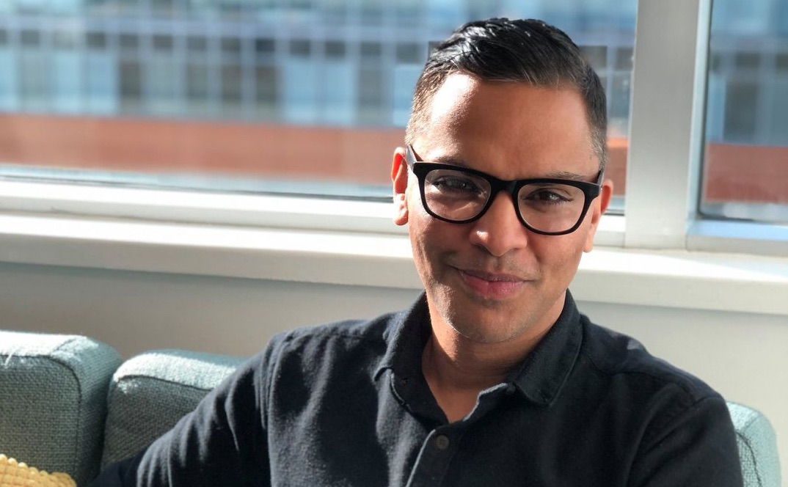

  <section id="one">
    

      
 
         
      

      <header class="major">
        <h1>About Gagan</h1>
      </header>

      
      
I’m a designer, strategist, and coach with 20+ years of experience in product, research, and leadership. I help people find clarity, build trust, and lead with confidence.

      <h2>My Path</h2>
      
In 2001, I founded <a href="https://designstamp.com" target="blank">DesignStamp</a>, a research and design studio that tackles complex challenges across business, tech, and public health. I have led projects for the Gates Foundation, OECD, and PEPFAR—the world’s largest global health initiative.

      
I’ve created UX and management courses, taught at Vancouver Film School, delivered talks across Canada, and spent years mentoring and managing growing teams. As VP of Experience Design at Thinkific, I scaled design and research during a period of rapid growth and helped lead the company to a $1B IPO valuation.

      <h2>What I Do Today</h2>
      
Today, I coach tech professionals and leaders, facilitate strategy workshops, and help people navigate big decisions and moments of change. I specialise in helping people see their strengths clearly, and use them more intentionally.

    
I live in Toronto, Canada 🇨🇦, and work with clients across North America and Europe.

  

    Explore my coaching programs for 
    <a href="CoachingForLeaders.html">leaders</a>, 
    <a href="TeamWorkshops.html">teams</a>, and 
    <a href="NextUp.html">career transitions</a>. 
    I also offer <a href="OngoingCoaching.html">ongoing coaching</a> for long-term growth and accountability.
  

    

      <h2>Why Coaching</h2>
      

        

        
I’ve witnessed firsthand how even the best ideas stall when teams face unclear direction, misaligned goals, or a lack of trust and accountability.

		
Throughout my career, I’ve been lucky to work with great coaches. Coaching created space to think, test, reflect, and act — helping me move with intention, even in times of uncertainty.

		
After years in design leadership, coaching felt like a natural next step. The way we build products is broken. I want to do my part to shape healthier ways of working so we can create better outcomes together.

          <blockquote>
            You cannot be what you cannot see.  
            — Marian Wright Edelman
          </blockquote>

          
My approach blends systems thinking, user-centered design, and strategic questioning. Whether you’re stepping into leadership, navigating a pivot, or trying to communicate with more impact, I’ll help you do it with clarity and purpose.

          <h2>My Coaching Style</h2>
          

			  
            <strong>Hope is not a plan!</strong> A coach helps you move from              where you are  
            to   where you want to go ...with a plan to get there.

          

          
I coach with a mix of empathy and accountability. I’ll support you *and* I’ll  challenge you to name what you want, own what’s holding you back, and do the work to grow.

          
I work especially well with curious people who think deeply, lead quietly, and care about others but sometimes need help speaking up, zooming out, or stepping into their full power.

          
I believe in equity, access, and representation. I’m especially committed to supporting women, BIPOC, and LGBTQ+ leaders in shaping the future of work.

          <!--   start of faq -->
          <h2>Frequently Asked Questions</h2>
          

            

              

                What is your background in design and coaching?
                <i class="fa fa-plus faq-icon"></i>
              

              

                
I’ve been a designer, researcher, and team builder for over 20 years. I’ve worked with global NGOs, tech companies, and startups. Most recently, I led design and research at Thinkific during a period of rapid growth and IPO. I’ve coached emerging leaders, ICs, and senior execs through transitions, team challenges, and moments of career change.

              

            

            

              

                Who do you typically coach?
                <i class="fa fa-plus faq-icon"></i>
              

              

                
I work with product and design professionals—ICs, new managers, senior leaders, and teams. Some are trying to grow into their next role; others are figuring out what comes after a plateau or burnout. I also coach people navigating systems that weren’t designed for them, including BIPOC, women, and LGBTQ+ professionals in tech.

              

            

            

              

                How is coaching different from mentorship?
                <i class="fa fa-plus faq-icon"></i>
              

              

                
Mentorship is often advice-based. Coaching is about reflection, alignment, and accountability. Each of us do better when we find our own answers instead of someone giving them to us. I’ll help you find yours, challenge your assumptions, and move toward what you want with clarity and confidence.

              

            

            

              

                What can I expect from coaching with you?
                <i class="fa fa-plus faq-icon"></i>
              

              

                
We’ll start by getting clear on what’s most important to you. Then we’ll build a structure to get there through regular coaching, tools, reflection prompts, and accountability. I’ll adapt the process as we go to match your energy, schedule, and growth goals.

              

            

            

              

                What coaching formats do you offer?
                <i class="fa fa-plus faq-icon"></i>
              

              

                
One-on-one coaching (weekly, biweekly, or monthly), team workshops, and longer-term development programs. I also offer text-based support when you need it (especially around job interviews, leadership transitions, major decisions).

              

            

            

              

                What makes your coaching approach unique?
                <i class="fa fa-plus faq-icon"></i>
              

              

                
I bring a blend of strategic thinking, research depth, and real-world leadership experience. I’m deeply empathetic, quick to spot patterns, and not afraid to ask the question behind the question. I am here to support you in the journey ahead!.

              

            

            

              

                Do you offer flexible payment options?
                <i class="fa fa-plus faq-icon"></i>
              

              

                
Yes. Coaching should be accessible. I offer payment plans and reduced rates for those from underrepresented or marginalized backgrounds in tech. I want great coaching to be within reach for anyone who needs it.

              

            

          

        

        <!-- Right Column -->
        

          

            <h3>What to Expect</h3>
            
Depending on your needs, we’ll tailor a plan. If you’re in transition, weekly coaching builds momentum. If you’re a senior leader, monthly check-ins offer just-in-time support—on anything from team dynamics to strategic decisions.

          

          

            <h3>Why Me</h3>
            <ul>
              <li><strong>Experience that matters:</strong> 20+ years in design, research, and leadership.</li>
              <li><strong>Empathy and edge:</strong> I’ll meet you where you are and help you move forward.</li>
              <li><strong>Tools that work:</strong> Frameworks to clarify your thinking and build confidence.</li>
              <li><strong>An equity lens:</strong> I support people from all backgrounds and walk the talk.</li>
              <li><strong>Your growth partner:</strong> I’m here to help you unlock your next chapter...and enjoy it!</li>
            </ul>
          

        

      

    

  </section>

